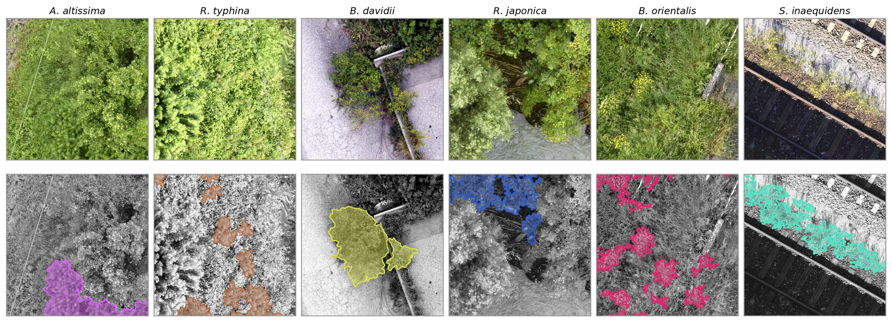

# AI4Good: Neophyte segmentation from drone orthophotos

Invasive plant species are one of the main drivers of global biodiversity loss,
which is why combating them is a target of the Sustainable Development Goals of
the United Nations. Doing so depends on knowing where they grow, and
segmenting high-resolution aerial imagery is currently the only promising way to
detect them automatically over large areas. This repository maps six neophyte
species per pixel in drone orthophotos, built with PyTorch:

---

| Species | English | German | Height [m] |
|:--------|:--------|:-------|:-----------|
| *Ailanthus altissima* | tree of heaven | Götterbaum | >25 |
| *Rhus typhina* | staghorn sumac | Essigbaum | 6 |
| *Buddleja davidii* | butterfly bush | Sommerflieder | 3 |
| *Reynoutria japonica* | Japanese knotweed | Japanischer Staudenknöterich | 3 |
| *Bunias orientalis* | Turkish wartycabbage | Orientalisches Zackenschötchen | 1.2 |
| *Senecio inaequidens* | narrow-leaf ragwort | Schmalblättriges Greiskraut | 0.6 |



---

## Key challenges

The same species looks different from one site to the next: it is at another
phenological stage, has different growing conditions, and grows into another background vegetation. A model can therefore score well on tiles from
orthophotos it has seen and fail at a site one nearby, which makes
cross-site generalisation the first key challenge.

The second one is data scarcity. Annotating neophytes in nadir imagery is hard
even for experts, and for a large number of invasive species there are no labels
on high-resolution aerial imagery at all, which puts the task somewhere between
few-shot and zero-shot segmentation.

Methods that address these challenges are in high demand.

- open-vocabulary segmentation
- self-supervised backbones
- parameter-efficient fine-tuning
- synthetic supervision from the citizen-science

No limits on creativity here.

---

## 1. Setup

```bash
conda env create -f environment.yml
conda activate ai4good-neophytes
```

The repo expects the datasets next to it, i.e. `../data/` seen from the repo
root. Adjust the paths in `configs/data/split_*.yaml` if yours live elsewhere.

```
Repos/
├── ai4good-neophytes/     <- this repo
└── ...
data/
├── Neophytes/           drone tiles + labels
├── NeophytesCSRaw/      citizen-science photos
└── NeophytesCSCutouts/  plant cut-outs from those
```

---

## 2. The data

> **The datasets are not public.** They are made available confidentially for this
> course only. Do not redistribute them, do not publish them, and do not upload
> them or crops of them anywhere outside the course, including in reports, slides
> or repositories that leave the course.

### 2.1 Drone dataset (`../data/Neophytes/`)

20 sites flown multiple times in 2024 and 2025 across Switzerland, each orthophoto cut into
2048 × 2048 px tiles at roughly 1.5–3 mm ground sampling distance.
41 763 tiles in total, split per site into `train` / `val` / `test`.

```
Neophytes/
├── stats_imagewise.csv              per-tile statistics (see 2.2)
└── <year>/<site>/<split>/
    ├── images/      2048² RGBA GeoTiff, the orthophoto tile
    ├── masks_prep/  2048² 3-band GeoTiff label (see below)
    ├── dsm/         1024² float32, digital surface model [m]
    └── dtm/         16² float32, terrain model [m], from swisstopo swissALTI3D
```

Site folders are `<site>_<flight>`: in `Basel_2_1` the site is `Basel_2`
and `_1` is one flight over it, flown on one date. Several flights per site cover
different points of the season. The cross-validation folds are defined on sites,
so all flights of a site are held out together.

The label tile carries three bands:

| band | meaning | values |
|------|---------|--------|
| 1 | class | `0` background, `1–6` species, `254` and `255` excluded |
| 2 | canopy density | `0` unknown, `10…100` percent cover in steps of 10 |
| 3 | phenological phase | `0` unknown, `1` non-flowering, `2` flowering, `3` fruiting, `4` excluded |

`254` and `255` are mapped to `ignore_index` (`-1`) by `value_mapping` in
`configs/data/data.yaml`: those pixels contribute neither to the loss nor to any
metric. Bands 2 and 3 are only loaded when `load_auxiliary: True`; they drive the
per-condition breakdown in `test.py` ("how well is a species found while it
flowers, and under a closed canopy?").

Elevation is optional. `nDSM = DSM − DTM` is the height of an object above the
ground, an additional channel that carries information the orthophoto does not:
how tall a plant is. The model configs
`model_neophytes_mit_b2_ndsm.yaml` (fused into the pretrained encoder) and
`model_neophytes_mit_b2_ndsm_concat.yaml` (concatenated to RGB) show both ways of
feeding it in. Mind the resolutions: the DSM comes from the photogrammetric
reconstruction at 1024² per tile, half the linear resolution of the orthophoto,
while the DTM is
[swissALTI3D](https://www.swisstopo.admin.ch/en/height-model-swissalti3d), the
national terrain model of swisstopo at 0.5 m resolution, resampled onto the tile
grid at 16² per tile.
Both are interpolated up to the image grid. Nothing forces you to use them combined, `in_channels` can just as well ask for `dsm` or `dtm` alone.

### 2.2 `stats_imagewise.csv`

One row per tile with the pixel count and area per class (split by phenological
phase) and the size of the empty orthophoto margin. Weighted sampling, few-shot
selection and the `max_nodata_frac` filter all read it, so they never have to
open a tile to know what is inside.

Regenerate it after adding / modifying tiles:

```bash
python dataset_stats.py --data-root ../data/Neophytes
```

### 2.3 Citizen-science data (optional, no code in this repo)

Two additional sources are provided as raw material. Whether and how to use them is up to you.

```
NeophytesCSRaw/                      ~26 GB
├── gsd.csv                          per photo: estimated resolution, mask coverage, keep flag
├── images/<NN_Genus_species>/*.jpg  iNaturalist photos (research grade, CC licensed)
└── masks/<NN_Genus_species>/mask_*.png  plant segmentation mask per photo

NeophytesCSCutouts/                  ~6.6 GB
├── README.md                        folder description, cutouts.csv columns, licences
├── species_overview.csv             the 53 species: invasive or look-alike, confounders
├── cutouts.csv                      index with one row per cut-out
└── <NN_Genus_species>/*.png         RGBA cut-out, transparent outside the plant
```

---

## 3. Quickstart

```bash
# 1: does the pipeline run? two sites, one epoch, small model
python train.py data=neophytes_split_debug_1024 model=model_debug

# 2: a real run, random tile split inside every site (no unseen site)
python train.py data=neophytes_split_local_train_1024 model=model_neophytes_mit_b2

# 3: evaluate it (exp_name = the directory created under lightning_logs/)
python test.py exp_name=20260916_101500.123456_np_loc_Unet_mit_b2_1024_s42
```

Any config value can be overridden on the command line:

```bash
python train.py model.lr=0.0002 model.max_epochs=30 data.batch_size_train=4
python train.py data=neophytes_split_cv1_train_1024 model=model_neophytes_mit_b2_ndsm
```

Training writes to `lightning_logs/<exp_name>/`, evaluation to
`lightning_logs/<exp_name>/test_<timestamp>_.../`. Metrics go to a CSV by
default; set `logger=wandb` (after `wandb login`) for Weights & Biases.

---

## 4. Faster experiments, and fitting on a small GPU

The default (1024 px crops, testing on whole 2048 px tiles) is what the final
numbers should be produced with, but it is expensive, and with a MiT encoder it
does not fit on a consumer GPU.

Two independent levers, both just a different data config:

**(a) Smaller crops, same resolution** (`transforms_512`). The crop window is
~512 px of the original tile and is fed to the network at 512 px, so plants keep
their size in pixels and only the context shrinks (cheap and low-risk)

```bash
python train.py data=neophytes_split_cv3_train_512 model=model_neophytes_mit_b2
python test.py exp_name=<run>   # the normal cv3 test split, nothing changes at test time
```

**(b) Half resolution** (`neophytes_split_cv<n>_train_512_ds2`, where **`ds2`
stands for downsampled by a factor of 2**). A ~1024 px window is resampled down to a 512 px
crop, so the model sees the same ground area as the default config with a quarter
of the pixels, at roughly 4.6 mm/px instead of 2.3. Four times less work in both
training and testing, at the price of detail: expect the small herbs
(*B. orientalis*, *S. inaequidens*) to lose the most.

```bash
python train.py data=neophytes_split_cv3_train_512_ds2 model=model_neophytes_mit_b2
python test.py exp_name=<run>   # auto-selects neophytes_split_cv3_test_ds2
```

Resolution is the one setting that should match between training and testing: a
model trained on half-resolution crops has to be evaluated on half-resolution
tiles, or every plant appears twice as large as anything it saw during training.
That is why the `_ds2` runs carry `np_cv<n>_ds2` in their `data_name` and `test.py`
routes them to the matching `_test_ds2` config, which downsamples the tiles the
same way. The scores are then computed on a 1024 px label grid resampled with
nearest neighbour, so thin structures shrink or vanish: comparable *between*
half-resolution runs, but report final numbers at full resolution.

Crop size, in contrast, does **not** necessarily have to match. Many encoders (e.g. ResNets, MiT/SegFormer) are
resolution-agnostic: ResNets are fully convolutional, and MiT/SegFormer
deliberately has no positional embedding, so a model trained on 512 px crops runs on a whole
2048 px tile unchanged. No test-time tiling is
needed, which is why `patch_2_img_size` stays `False`. It exists for e.g.
ViT-based architectures (`DPT`), where a fixed patch grid does tie the model to
one input size.

If a run still does not fit: lower `data.batch_size_train`, use `mit_b0` or a
CNN encoder, and set `data.batch_size_test=1`, since the configured 2 already runs out of
memory with `mit_b2` on 2048 px tiles on a 24 GB card.

---

## 5. The metric that counts: F1 in cross-validation

The interesting question is not how well a model does on tiles from orthophotos
it has already seen, but whether it recognises a species **at a site it has never
seen**.

The five folds in `cv_folds` (`configs/data/neophytes_names_colors.yaml`) each
hold out four sites; every site is held out exactly once. Train five models,
evaluate each on its own held-out sites, and report the **mean ± std of the F1
score over the folds, overall and per class**. That is the headline number of
this project, and the one to compare methods on.

```bash
# train the five folds (each is a full training run)
for i in 1 2 3 4 5; do
  python train.py data=neophytes_split_cv${i}_train_1024 model=model_neophytes_mit_b2
done

# evaluate each fold on its held-out sites
for run in lightning_logs/*np_cv*; do
  python test.py exp_name=$(basename "$run")
done

# aggregate: the table, the CSV and the bar chart with error bars
python evaluate_cv.py --runs '*np_cv*_mit_b2_*' --out results/cv/mit_b2
```

### Iterating on a single fold

Five full trainings per idea is a lot. For day-to-day experiments, run **`cv3`** (its score usually sits closest to the five-fold mean)
and only do the full five-fold sweep once a method looks promising. Reference
numbers from the Unet + MiT-b2 baseline (mean F1 without background, two seeds):

Report always the per-class F1 as well as the mean: background aside, the six species
are not equally hard. The two herbs are the small, sparse ones and usually
dominate the error, and an average that hides them is easy to improve for the
wrong reasons.

---

## 6. Repo structure

```
train.py             training loop; builds datamodule + model, fits, runs a test pass
test.py              loads a checkpoint, computes all metrics and the qualitative figures
inference.py         applies a model to whole orthophotos, writes georeferenced GeoTiffs
evaluate_cv.py       aggregates the five CV folds
dataset_stats.py     builds stats_imagewise.csv from the dataset

datasets/
  neophyte_dataset.py     reads tiles + labels (+ elevation), class mapping, sample weights,
                          few-shot selection, optional RAM preloading
  neophyte_datamodule.py  train/val/test/pick dataloaders, weighted sampler
models/
  semseg_plm.py           LightningModule around an SMP model, elevation fusion, metrics
utils/
  transform_utils.py      builds the albumentations pipeline from the config
  crop_transforms.py      TargetedRandomResizedCrop: crops anchored on foreground
  callback_utils.py       builds the Lightning callbacks from the config
  scheduler_utils.py      LR schedulers from the config
  eval_utils.py           confusion-matrix metrics, breakdowns, plots, prediction figures
  utils.py                small path/dict helpers
configs/
  train.yaml test.yaml inference.yaml       top-level configs
  data/    splits, class definitions, transforms, sampling
  model/   architectures, inputs, loss, schedule
```

Generated output stays out of the repo: `lightning_logs/`, `results/`,
`inference/` and `wandb/` are gitignored. Write your own scripts' output to
`results/<topic>/`.

---

## 7. How the configuration fits together

`python train.py` reads exactly one file, `configs/train.yaml`. That file holds
the run-level settings (experiment name, seed, logger, paths) and a `defaults`
list naming one data config and one model config. Each of those is in turn only a
`defaults` list, so the full config is assembled from seven files:

```
python train.py
└── configs/train.yaml                       exp_name, seed, logger, log paths
    ├── data: neophytes_split_cv3_train_1024.yaml    fold-specific overrides
    │   ├── data.yaml                        sampling, batch sizes, value_mapping, few-shot
    │   ├── neophytes_names_colors.yaml      class names, colours, display order, CV folds
    │   ├── split_cv3.yaml                   which site folders are train / val / test
    │   └── transforms_1024.yaml             crop size, augmentations, normalization
    └── model: model_neophytes_mit_b2.yaml   encoder override
        └── model.yaml                       architecture, inputs, loss, schedule, callbacks
```

Everything a file pulls in lands under `data.*` or `model.*`, which is why
overrides read like `data.batch_size_train=4` and `model.lr=0.0002`. Later entries
in a `defaults` list win over earlier ones, a file's own keys win over everything
it pulls in, and the command line wins over all of it. `test.yaml` and
`inference.yaml` are built the same way.

Swapping one line of a `defaults` list is therefore a whole experiment: the five
CV folds differ only in their `split_cv<n>` entry, and the half-resolution configs
of section 4 only in their `transforms_` entry. A new experiment often means
writing a little new config, not touching code.

Things worth knowing about the defaults:

- **Class imbalance.** `weighted_sampling: inverse_image` draws a tile with a
  probability derived from how rare its rarest class is, counted per image rather
  than per pixel, so one huge blob does not outvote a hundred small plants.
  `bg_fraction` caps how much of an epoch is background-only tiles, and
  `cap_quantile` / `lift_quantile` keep the rarest class from being drawn in
  nearly every batch. The loss (`Focal`) attacks the same problem from the other
  side. Pushes senecio, which appears in many images but doesn't have much label area
- **Targeted crops.** `TargetedRandomResizedCrop` anchors the training crop on a
  foreground pixel with probability `targeted_prob`.
- **Few-shot subsets.** `few_shot_k` restricts training to k images per class, for
  experiments on how much labelled data is really needed. The default
  `few_shot_mode: max_px_site_pheno` spreads those k images over sites and
  phenological phases; `few_shot_bg_k` controls how many background-only tiles come
  on top. See `configs/data/data.yaml` and `select_few_shot_for_class` in
  `datasets/neophyte_dataset.py` for the other selection modes.
- **Validation.** `val_few_shot_k: null` validates on the complete val set,
  including background-only tiles. Filtering them away makes validation fast but
  hides false positives on empty ground.

---
